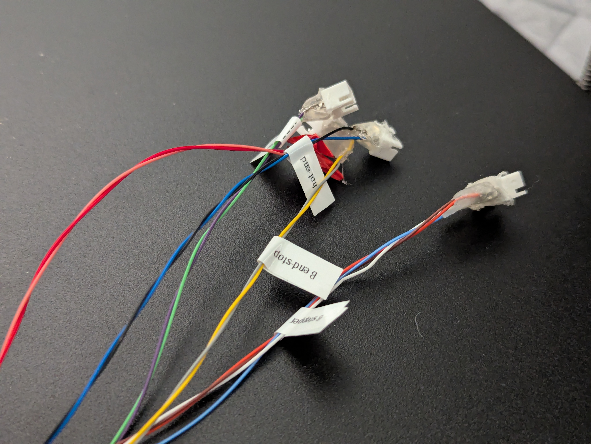
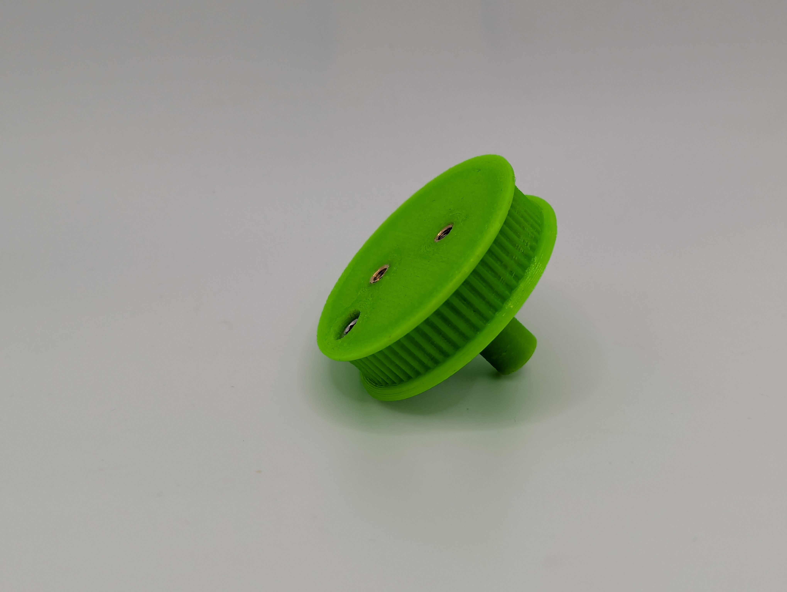
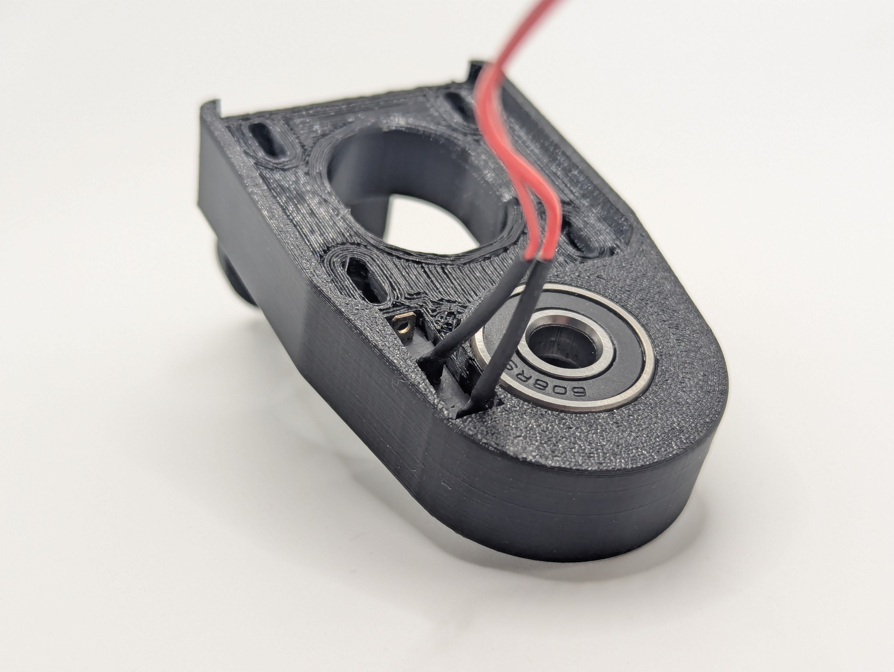
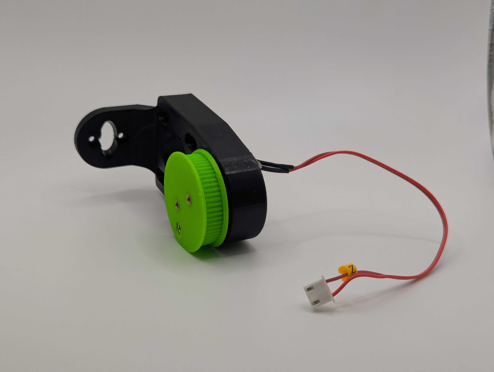
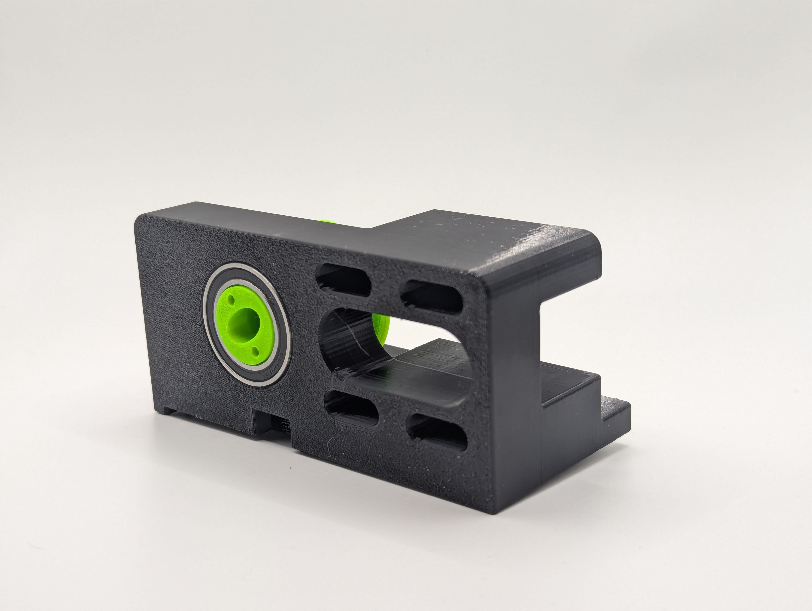
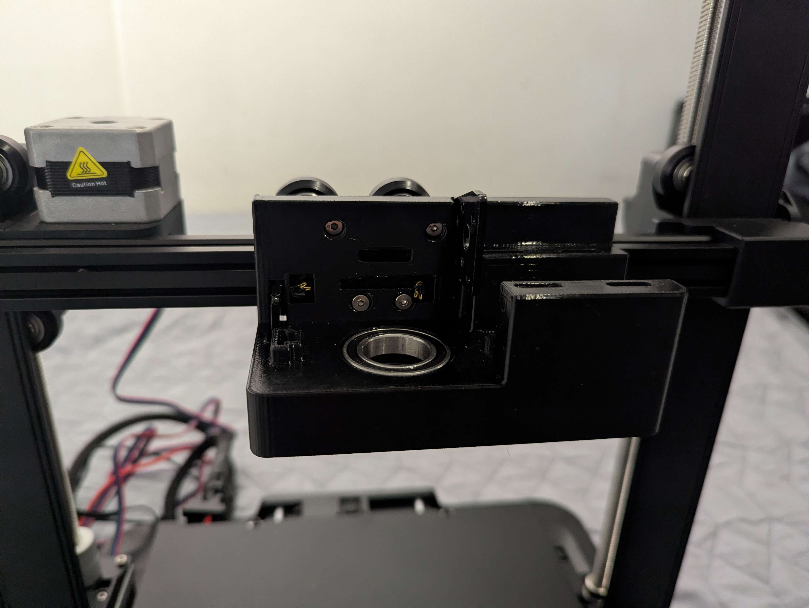
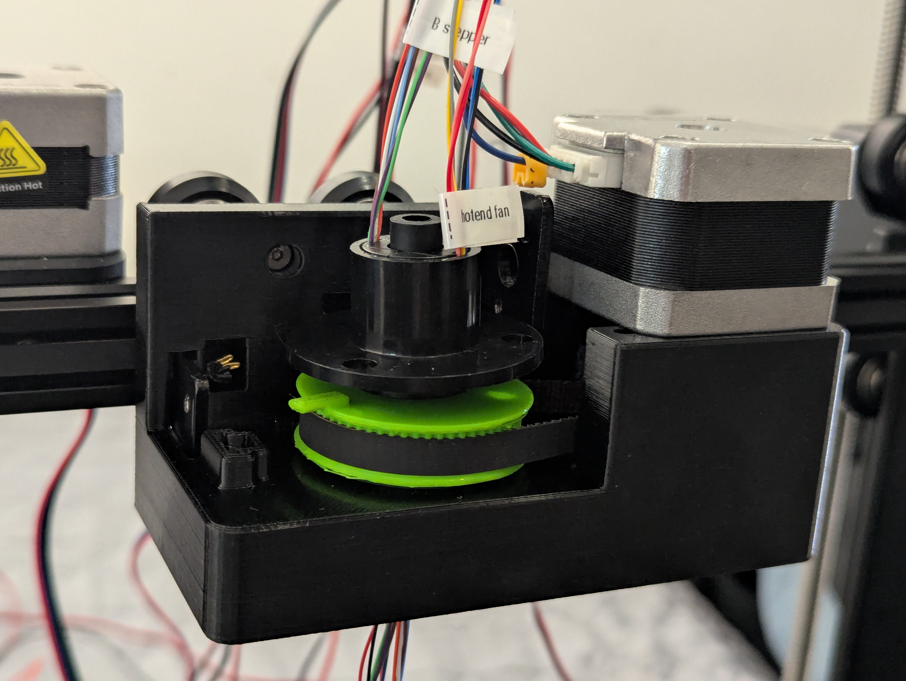
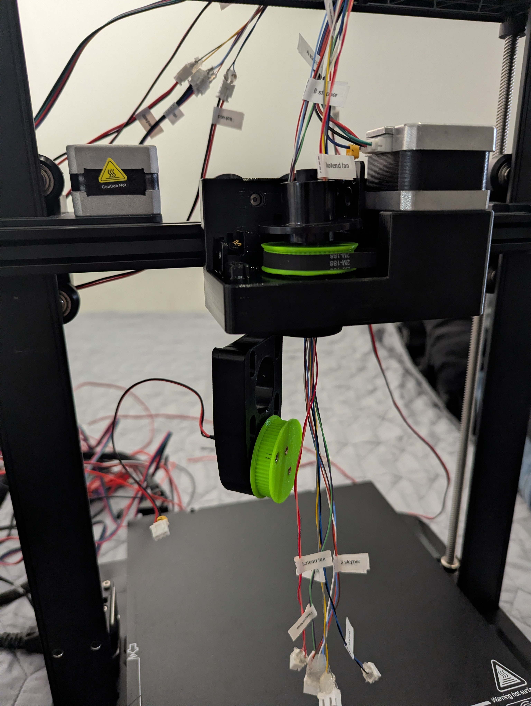
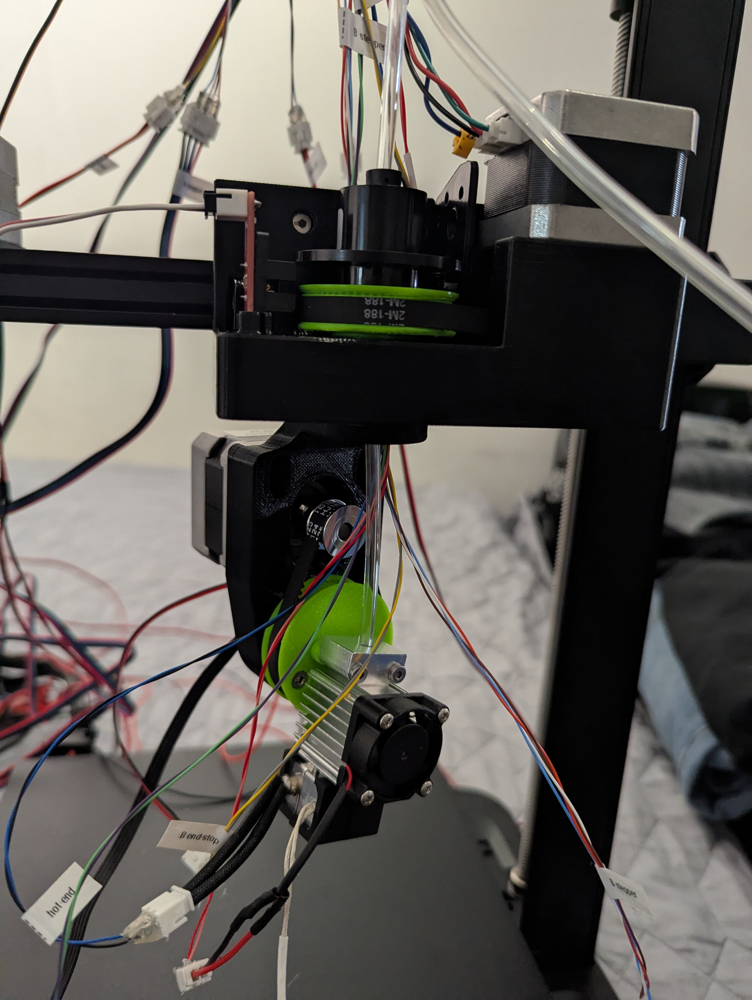
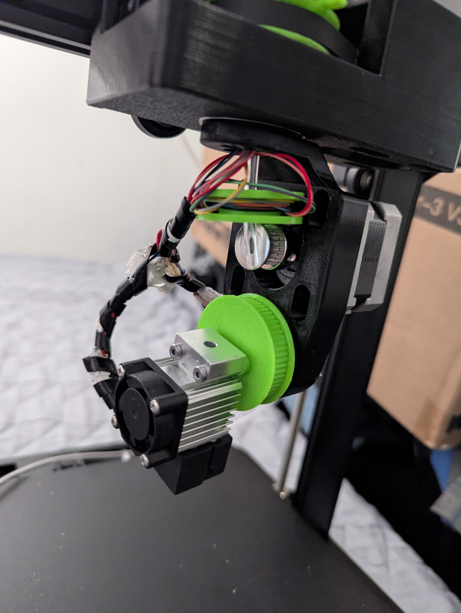

# Rep5x - Universal assembly instructions

Complete build instructions for converting any compatible 3D printer to 5-axis capability. Based on proven build process from working prototypes.

## Before you start

**Important: Read through this entire document before beginning assembly.** This will help you understand the complete process, identify any missing components, and plan your build timeline effectively.

### Contributing improvements
If you discover easier methods, better techniques, or have suggestions for improvement during your build, please contribute back to the project:
- **Open a Pull Request** on GitHub with your proposed changes
- **Document your improvements** with photos and clear explanations  
- **Share your experience** in our [Discord community](https://discord.gg/GNdah82VBg)
- Help make Rep5x better for everyone!

## Prerequisites

### Tools required
- **3D printer** - For printing Rep5x components
- **Hex keys** - M2.5, M3 sizes (long hex key needed for A-axis stepper installation)
- **Wire strippers and connecting tools** - For wire connections (crimping tools if using JST, soldering iron if soldering)
- **Multimeter** - For electrical testing
- **Computer** - For firmware flashing and calibration

### Skills required
- **Basic 3D printing** - Print settings and quality control
- **Basic electronics** - Wiring and wire connections (soldering or crimping)
- **Firmware flashing** - Arduino IDE or VSCode with PlatformIO
- **Mechanical assembly** - Heat insert installation, bearing installation

### Time estimate
- **Electronics preparation**: 4-6 hours (board flashing, testing, slip ring prep)
- **Component preparation**: 2-3 hours (steps 5-9)
- **Mechanical assembly and installation**: 4-6 hours (steps 10-14)
- **Final testing and calibration**: 2-4 hours (step 15)
- **Total**: 12-19 hours over several days

## Part 1: Electronics preparation

### Step 1: Gather all materials

#### Verify you have all components from:
- **[Universal BOM](universal-parts/bom-universal.md)** - All shared components
- **[Printer-specific BOM](printer-specific/)** - Additional printer-specific components
- **3D printed parts** - All components printed and quality checked

### Step 2: Flash your control board

#### Download firmware configuration
Download the Marlin firmware configuration from your printer-specific folder:
**[Find your printer's firmware config](printer-specific/)**

#### Flash firmware
1. **Download Marlin 2.1.x** from official repository
2. **Replace configuration files** with Rep5x versions
3. **Compile and upload** to control board
4. **Verify upload successful** via serial connection

### Step 3: Remove old control board

1. **Power down printer** completely
2. **Disconnect all cables** from old control board
3. **Remove old board** from electronics enclosure

### Step 4: Install new control board and test basic functions

#### Install control board
1. **Place new board** next to your printer
2. **Set all jumpers correctly** according to the wiring diagram for your control board
3. **Install TMC2208 drivers** in all 6 positions (X, Y, Z, E, A, B)
4. **Connect all printer components** (steppers, end-stopsm
, heated bed, thermistors, hot-end etc.)
5. **Connect power supply** and verify 24V input

#### Test all components work correctly

Test each component with G-code commands:

**Motors (movement test):**
```gcode
G28        ; Home all axes
G1 X100    ; Test X motor
G1 Y100    ; Test Y motor  
G1 Z50     ; Test Z motor
G1 E10     ; Test extruder motor
G1 A10     ; Test A-axis motor (yaw rotation)
G1 B10     ; Test B-axis motor (tilt rotation)
```

**Heated bed:**
```gcode
M140 S60   ; Set bed temperature to 60°C
M105       ; Check temperatures
M140 S0    ; Turn off bed heater
```

**Hotend:**
```gcode
M104 S180  ; Set hotend to 180°C
M105       ; Check temperatures
M104 S0    ; Turn off hotend
```

**Thermistors:**
```gcode
M105       ; Read all temperatures - should show room temperature
```

**Endstops:**
```gcode
M119       ; Check all endstop status - should show current state
```

**Important**: All basic printer functions must work before proceeding.

## Part 2: Component preparation

### Step 5: Prepare slip ring with wire connections

#### Slip ring wiring requirements
The slip ring needs the following connections:
- **1x 4-pin connection** - For B-axis stepper motor
- **4x 2-pin connections** - For: hotend fan, hotend heater, hotend thermistor, B-axis endstop

#### Wire connection preparation
1. **Cut wires to appropriate lengths** for routing through slip ring (or keep full length for safety - prevents wires being too short, though cable management is harder)
2. **Connect wires** using your preferred method:
   - **JST connectors** (recommended) - Clean, removable connections
   - **Direct soldering** - Permanent but reliable, no prep needed for now
   - **Wire nuts or terminal blocks** - Alternative connection methods
3. **Test continuity** of all connections using a multimeter

**Note**: JST connectors are not required but preferred over permanent soldering for easier maintenance and troubleshooting.



*Figure 1: Slip ring prepared with JST connectors for easy connection and disconnection*

### Step 6: Prepare B-driven-pulley

#### Heat insert installation
1. **Install 2x M3 heat-set inserts** in B-driven-pulley
2. **Install M3x10 socket head bolt** in one insert
3. **Adjust bolt position** - should stick out slightly to trigger microswitch endstop
4. **Test fit** - bolt should protrude ~1-2mm for reliable endstop triggering



*Figure 2: B-driven-pulley with heat-set inserts and endstop trigger screw installed*

### Step 7: Install bearings in B_arm

#### Bearing installation
1. **Install 2x 608 bearings** in B_arm bearing pockets
2. **Press fit carefully** - bearings should sit flush and rotate smoothly

### Step 8: Install and position microswitch in B_arm

#### Microswitch preparation
1. **Install microswitch** in B_arm mounting location
2. **Trim or remove metal actuator** needed for proper positioning
3. **Test position** - Install B-driven-pulley temporarily and check when screw clicks microswitch
4. **Find sweet spot** - Adjust for reliable triggering without interference
5. **Secure with hot glue** once optimal position found



*Figure 3: B_arm assembly showing installed bearings and positioned microswitch*



*Figure 4: B_arm connected to B-driven-pulley, showing complete tilt mechanism*

### Step 9: Prepare carriage mount

#### Bearing installation 
1. **Install 2x 61804 bearings** in carriage mount
2. **Verify smooth rotation** and proper seating

**Note**: Do not install the A-driven-pulley yet - this must be done after attaching to the printer since the pulley blocks access to mounting screws on some printers like the Ender 3 V3 SE.



*Figure 5: Carriage mount with 61804 bearings installed - ready for mounting to printer*

## Part 3: Installation on printer

### Step 10: Install carriage mount to X-axis

#### Carriage mount installation
1. **Remove original hotend assembly** from printer
2. **Attach carriage mount** to X-carriage using original mounting screws
3. **Verify clearance** with frame and motion systems



*Figure 8: Carriage mount attached to printer's X-carriage*

### Step 11: Install A-axis drive system

#### A-axis pulley, stepper and drive installation
1. **Install A-driven-pulley** in carriage mount
2. **Add optical sensor** to carriage mount for A-axis position sensing
3. **Mount A-axis (yaw) stepper motor** to carriage mount using 4x M3x6mm bolts
4. **Use long hex key** to access stepper motor mounting bolts
5. **Install GT2 timing belt** connecting stepper motor to A-driven-pulley
6. **Tension belt properly** - should be snug but not over-tensioned
7. **Route slip ring wires** through the A-driven-pulley center hole
8. **Connect A-axis stepper** directly to control board (not through slip ring)

<div style="display: flex; gap: 20px; align-items: flex-start;">
  <div>
    
    <p><em>Figure 8: A-driven-pulley installed in carriage mount</em></p>
  </div>
  <div>
    
    <p><em>Figure 9: Complete A-axis installation with stepper motor and belt</em></p>
  </div>
</div>

### Step 12: Install B_arm and connect wiring

#### B_arm installation and wire routing
1. **Route all wires and Bowden tube** through B_arm center
2. **Attach B_arm to carriage mount** using 2x M3x10mm bolts
3. **Verify clearances** - Both A and B axes should move freely
4. **Test mechanical limits** - Check rotation range without collisions
5. **Secure wire routing** - No pinching or interference during motion



*Figure 10: B_arm connected to carriage mount with proper wire routing*

### Step 13: Install B-axis drive system

#### B-axis drive system installation
1. **Install B-axis (tilt) stepper motor** to B_arm mounting points
2. **Install GT2 timing belt** connecting B-axis stepper to b-driven-pulley
3. **Tension belt properly** - should be snug but allow smooth rotation

### Step 14: Install hotend and final wiring

#### Hotend installation and complete wiring
1. **Attach hotend assembly** to B_arm mounting points
2. **Connect all hotend components** through slip ring connections:
   - Hotend heater (2-pin connection)
   - Hotend thermistor (2-pin connection)
   - Hotend cooling fan (2-pin connection)
3. **Connect B-axis stepper** through slip ring (4-pin connection)
4. **Connect B-axis endstop** through slip ring (2-pin connection)
5. **Check slip ring rotation** - should rotate freely without binding wires

#### Cable management
1. **Organize all wiring** for clean routing
2. **Secure loose cables** to prevent interference
3. **Test full motion range** with all cables connected

<div style="display: flex; gap: 20px; align-items: flex-start;">
  <div>
    
    <p><em>Figure 11: Complete assembly with all components connected (before cable management)</em></p>
  </div>
  <div>
    
    <p><em>Figure 12: Same assembly with cable management in progress</em></p>
  </div>
</div>

<div>
  
  <p><em>Figure 13: Completed Rep5x 5-axis printer ready for calibration</em></p>
  <p><strong>Note:</strong> Improved cable management photos coming soon - this build was done with limited cable organizers.</p>
</div>

## Part 4: Testing and calibration

### Step 15: System verification and testing

#### System verification
1. **Power up system** and verify no error messages
2. **Test all 6 axes** with careful manual G-code commands:
   - X, Y, Z axes: `G1 X10 F1000` (move slowly, verify direction)
   - A-axis: `G1 A45 F1000` (rotate in 45° increments)
   - B-axis: `G1 B10 F1000` (tilt slowly, watch for collisions)
   - Extruder: `G1 E10 F100` (extrude 10mm slowly)
3. **Verify endstops** trigger properly with `M119` command
4. **Check thermal systems**:
   - Hotend heating: `M104 S200` (heat to 200°C)
   - Bed heating: `M140 S60` (heat to 60°C)
   - Verify temperature readings are stable

#### Extruder calibration

**Why calibrate the extruder:**
- Incorrect E-steps leads to over/under-extrusion, poor print quality

**How to calibrate E-steps:**

1. **Mark filament** - Make a mark 120mm above the extruder entrance
2. **Heat hotend** - `M104 S200` (or your printing temperature)
3. **Extrude 100mm** - Send command: `G1 E100 F100`
4. **Measure remaining distance** - Measure from extruder entrance to your mark
5. **Calculate actual extrusion** - Should be 20mm remaining (120mm - 100mm)
6. **Calculate new E-steps**:
   - If more than 20mm remains → extruding too little
   - If less than 20mm remains → extruding too much
   - Formula: `New E-steps = (Current E-steps × 100) / Actual distance extruded`
   - Example: Mark is at 25mm instead of 20mm → only 95mm extruded
   - New E-steps = (Current × 100) / 95
7. **Update firmware** - `M92 E[new value]` then `M500` to save
8. **Verify** - Repeat test to confirm accuracy

#### 5-axis kinematic calibration

1. **Use Rep5x calibration tool** at [calibrator.rep5x.com](https://calibrator.rep5x.com/)
2. **Follow cone or camera-based calibration** procedure:
   - Cone method: Print calibration cone and measure deviations
   - Camera method: Use computer vision to detect tool center point offset
3. **Update firmware** with calibrated kinematic parameters:
   - A-axis offset
   - B-axis offset
   - Tool center point (TCP) coordinates
4. **Test print** simple geometry to verify functionality


---

**Assembly complete!** Your Rep5x 5-axis conversion should now be ready for calibration and first prints. Join our [Discord community](https://discord.gg/GNdah82VBg) for support and to share your successful build!