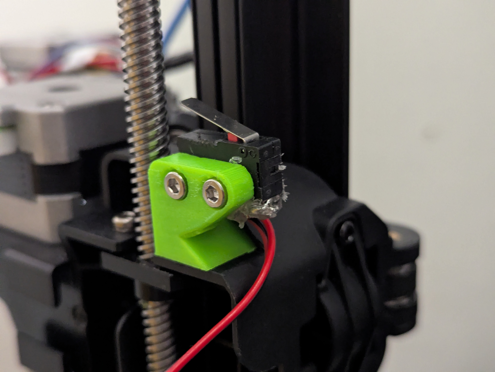
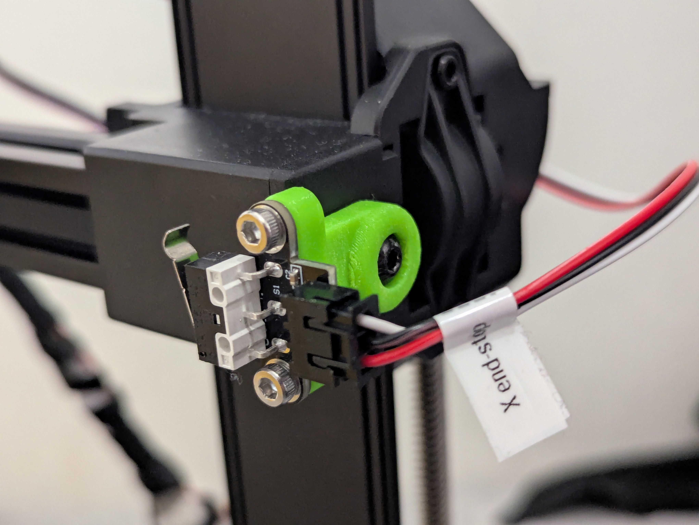
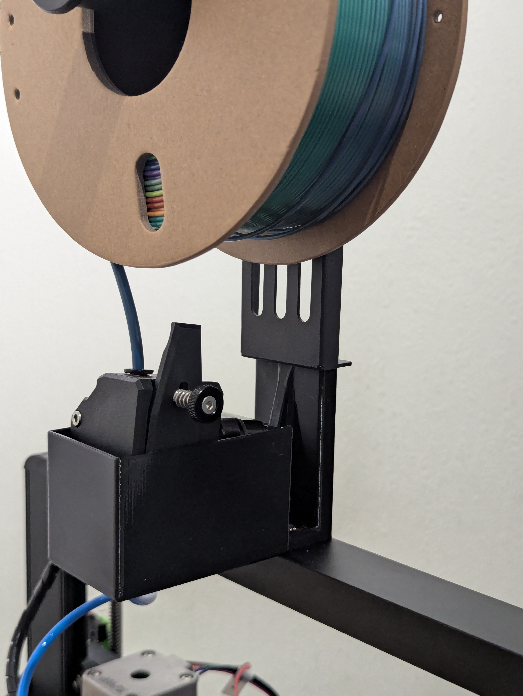

# Rep5x - Ender 3 V3 SE assembly instructions

Printer-specific assembly steps for the Ender 3 V3 SE. Follow the main [assembly instructions](../../assembly-instructions-universal.md) and complete these V3 SE-specific modifications.

## Z-axis endstop installation

Install microswitch on left side of X gantry using 3D printed Z endstop mount.

1. Remove the screw next to the Z-axis threaded rod on the left side of X gantry
2. Insert 3D printed Z endstop mount
3. Reinsert the original screw from step 1
4. Attach microswitch to mount

*Figure 1: Z-axis endstop mounted on left side of X gantry*

## X-axis endstop installation

Install microswitch on right side of X gantry using 3D printed X endstop mount.

1. Remove the belt tensioning screw on the right side of X gantry
2. Insert 3D printed X endstop mount
3. Reinsert the belt tensioning screw
4. Attach microswitch to mount

*Figure 2: X-axis endstop mounted on right side of X gantry*

## Extruder mount installation

Mount external Bowden extruder between spool holder and printer frame.

1. Remove original spool holder screws
2. Mount 3D printed extruder mount to printer frame using original spool holder screws
3. Attach external Bowden extruder to mount
4. Remount spool holder on top of extruder mount using M3x6mm screws (washers may be needed)
5. Route ~500mm PTFE Bowden tube from extruder to hotend

*Figure 3: External Bowden extruder mounted between spool holder and printer frame*

## Hotend modification

Stock hotend lacks Bowden tube retention. Either replace with Bowden-compatible hotend or modify stock hotend to retain PTFE tube.

## Display installation

Stock screen not compatible. Install BTT Mini 12864 display or run headless.

## Continue assembly

Follow main [assembly instructions](../../assembly-instructions-universal.md) parts 1-4 to complete the Rep5x conversion.

## Getting help

- **Discord**: [Discord community](https://discord.gg/GNdah82VBg)
- **Firmware**: Pre-configured Marlin in [`firmware/octopus-v1.1/`](firmware/octopus-v1.1/)
