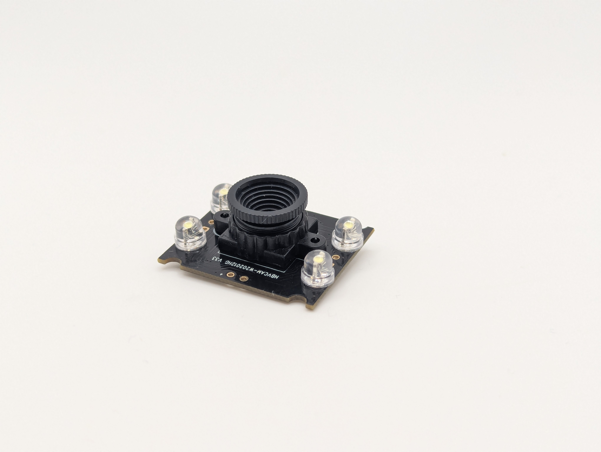
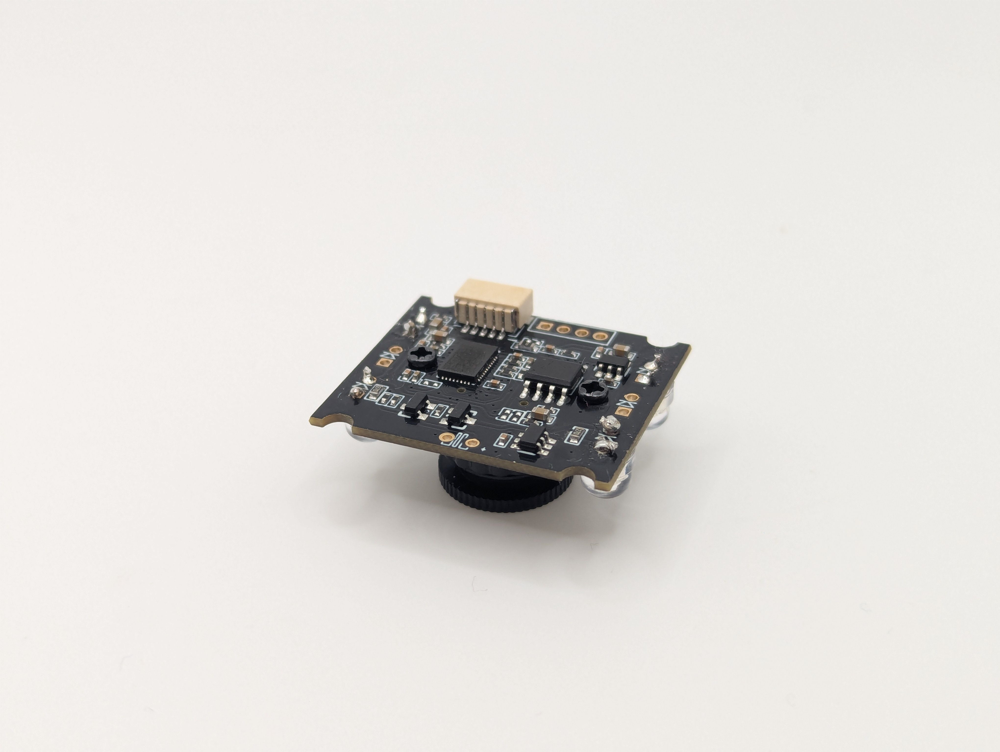
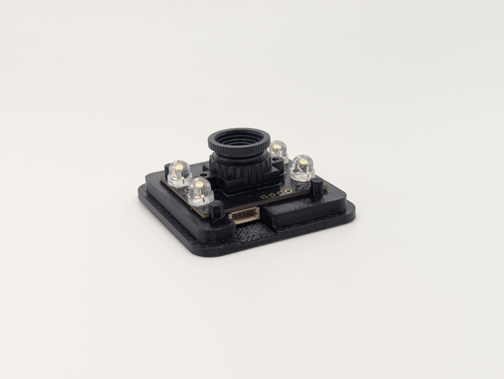
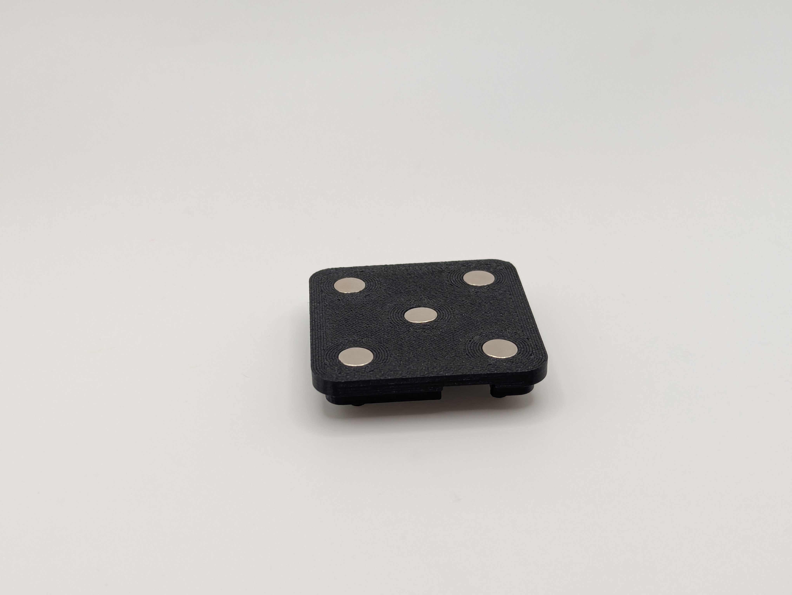
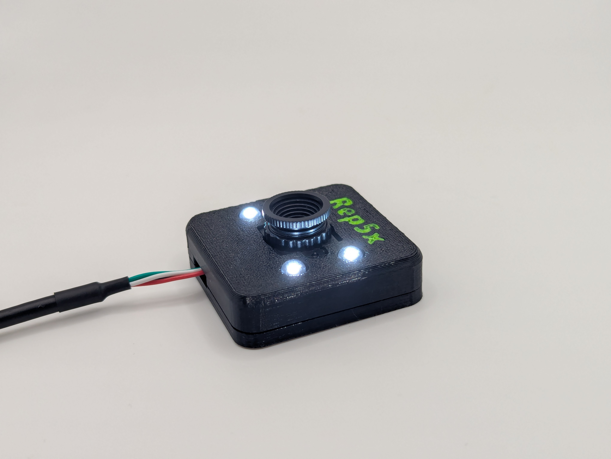
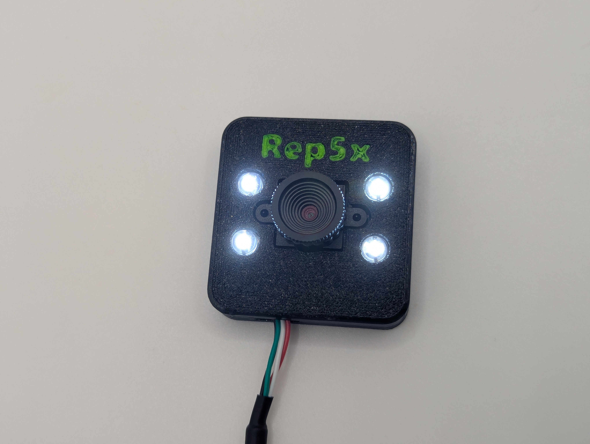

# Rep5x - Calibrator - Hardware

This guide covers everything you need to build your own Rep5x calibrator hardware.

## Discord community

Join our Discord for support, updates, and to share your builds:
**[https://discord.gg/GNdah82VBg](https://discord.gg/GNdah82VBg)**

---

## Overview

Rep5x supports two different calibration methods. Both methods measure the same thing, but use different approaches:

1. **Cone-Based Calibration** - Simple, low-cost method using a printed cone
2. **Camera-Based Calibration** - More advanced method using a camera

Choose the method that best fits your needs.

---

# Method 1: Cone-based calibration

## What you need

- Any standard cone geometry STL file
- 3D printer filament 

## How it works

Print any standard cone geometry for calibration purposes. The cone will adhere to the print bed during printing, giving a stable reference point for the calibration process.

## Assembly instructions

1. Download or create a standard cone STL file
2. Slice with your preferred slicer
3. Print the cone on your printer's bed
4. Run the Rep5x calibration process

### Reusable option (coming soon)
STL files with integrated magnet mounting holes will be published soon for a more permanent calibration solution.

---

# Method 2: Camera-based calibration

## Bill of materials (BOM)

### Camera module
**OV9726 USB Camera Module** - 1MP USB 2.0 camera with 70° field of view (plug and play, no drivers needed)

**Where to buy:**
- **AliExpress**: €6.99 - [Link](https://s.click.aliexpress.com/e/_c4kXJM6n)²
- **Amazon**: $9.99 - [Link](https://amzn.to/43kfNQX)¹

**Technical drawing:** See [OV9726-camera-dimensions.png](OV9726-camera-dimensions.png) for exact dimensions and mounting hole locations.

### LEDs (lighting)
**5mm Straw Hat White LEDs**

**Note:** I used 5mm Straw Hat White LEDs because I had them on hand, but any white LEDs should work. The 3D printed case files are available in Fusion 360 format, so holes can easily be modified for different LED sizes.

**Where to buy:**
- **AliExpress**:
  - €0.96 for 10 pieces
  - €1.32 for 100 pieces
  - [Link](https://s.click.aliexpress.com/e/_c34aCIrt)²
- **Amazon**: $7.49 for 100 pieces - [Link](https://amzn.to/4oBrtqm)¹

### 3D printed housing
The camera housing consists of two parts:
- **Bottom**: [3MF](camera-mount-bottom-v1.3mf) | [Fusion 360](camera-mount-bottom-v1.f3d)
- **Top**: [3MF](camera-mount-top-v1.3mf) | [Fusion 360](camera-mount-top-v1.f3d)

**Features:**
- Mounting point for the OV9726 camera
- 4x LED mounting holes (customizable in Fusion 360)
- 5x magnet mounting holes (6x2mm, Gridfinity compatible)

### Magnets
**6x2mm Neodymium Magnets** - Standard Gridfinity size (you may already have these!)

**Note:** These magnets are friction-fit into the bottom of the mounting plate, so no glue is needed. They keep the camera mounted to the printer bed.

**Where to buy:**
- **AliExpress**: €1.96 for 20 pieces - [Link](https://s.click.aliexpress.com/e/_c4aZJq5N)²
- **Amazon**: $5.99 for 45 pieces - [Link](https://amzn.to/43yHaXl)¹

## Total cost

| Component | Cost |
|-----------|------|
| Camera + USB cable | €6.99 |
| LEDs (10 pieces) | €0.96 |
| Magnets (20 pieces) | €1.96 |
| 3D printed housing | ~€0.10 (filament only) |
| **Total** | **~€10.50** |

---

## Assembly instructions

1. **Print the housing**
   Use the provided STL files to 3D print the camera housing. Standard PLA or PETG filament works well.

2. **Solder the LEDs**
   - Solder 4 white LEDs directly to the camera board's VCC and GND pads

   
   *Top view: LEDs soldered to the camera board*

   
   *Bottom view: Solder connections on the back of the camera board*

3. **Mount the camera**
   - Insert the OV9726 camera module into the housing
   - Ensure the lens is properly aligned and can rotate for focus adjustment

   
   *Camera module installed on the 3D printed mounting base*

4. **Install the magnets**
   - Press-fit 5x 6x2mm magnets into the holes on the bottom of the mounting plate
   - No glue needed - magnets should friction-fit securely
   - These magnets keep the camera firmly attached to your printer bed during calibration

   
   *Bottom view: 5x magnets friction-fit into the mounting plate*

5. **Connect USB cable**
   - Route the included USB cable through the housing
   - Connect to your PC

6. **Test the camera and adjust focus**
   - Plug the USB cable into your system
   - The camera should be recognized as a USB video device (no drivers needed)
   - Visit [http://calibrator.rep5x.com/](http://calibrator.rep5x.com/) to test the camera feed
   - Manually twist the lens to adjust focus while viewing the live feed

### Finished assembly

*Side view: Completed Rep5x camera calibrator ready for use*

*Top view: All 4 LEDs and camera lens visible*

---

## Technical specifications

### Camera specifications
- Model: HBV-W202012HD V33
- Sensor: OV9726 (1/6 inch) CMOS
- Resolution: 1280x720 (720p)
- Format: MJPG/YUY2
- Frame rate: 30 FPS @ 720p
- Interface: USB 2.0
- Power: USB powered (5V)
- Operating temperature: -30°C to 70°C
- Supported systems: Windows XP/7/8/10/11, macOS, Linux, Android

### LED specifications
- Type: 5mm Straw Hat / Round Top
- Lens: 5mm Diameter, Transparent
- Color: White
- Quantity: 4 pieces required
- Viewing Angle: 120°
- Forward Voltage: 3.0-3.2V (White)
- Power: 0.1W per LED
- Current: 20mA per LED (80mA total for 4 LEDs)
- Polarity: Anode (longer leg) | Cathode (shorter leg)

---

## Support & updates

- **Discord**: [https://discord.gg/GNdah82VBg](https://discord.gg/GNdah82VBg)
- **GitHub**: [https://github.com/dennisklappe/Rep5x](https://github.com/dennisklappe/Rep5x)

Hardware design files and updates will be posted as development progresses.

---

¹ Amazon links are referral links. All proceeds go directly to Rep5x development.

² AliExpress links are affiliate links. All proceeds go directly to Rep5x development.
