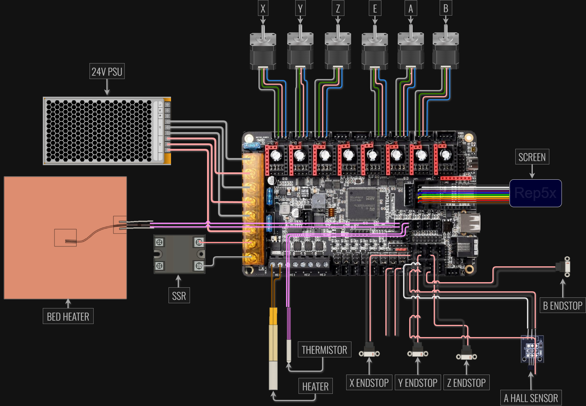

# BTT Octopus V1.1 (STM32F446ZE) configuration

Configuration for BigTreeTech Octopus V1.1 board with STM32F446ZE processor - used for the [Ender 5 Pro prototype](../../../printer-models/ender-5-pro/).

## Stepper driver layout

| Position | Axis | Driver Type | Interface | Notes |
|----------|------|-------------|-----------|-------|
| 0 | X | TMC2208 | UART | |
| 1 | Y | TMC2208 | UART | |
| 2 | Z | TMC2208 | UART | |
| 3 | E0 | TMC2208 | UART | Extruder |
| 4 | Yaw (I) | TMC2208 | UART | Rotational axis |
| 5 | Tilt (J) | TMC2208 | UART | Rotational axis |
| 6 | - | - | - | Available |
| 7 | - | - | - | Available |

## Wiring diagrams



*Rep5x specific connections for BTT Octopus V1.1*

- **[wiring-diagram-rep5x.png](wiring-diagram-rep5x.png)** - Rep5x specific connections (PNG format)
- **[wiring-diagram-5axis.svg](wiring-diagram-5axis.svg)** - Complete 5-axis wiring schematic (editable in draw.io)

## Wiring notes

### Driver configuration
**All TMC2208**
- UART communication
- Same driver type across all 6 axes

### Endstops
- X, Y, Z: Standard microswitch endstops  
- Yaw axis: Microswitch endstop
- Tilt axis: Hall effect sensor endstop

## Configuration details

### Key Settings
```cpp
// Board definition
#define MOTHERBOARD BOARD_BTT_OCTOPUS_V1_1

// Driver types - All TMC2208
#define X_DRIVER_TYPE  TMC2208
#define Y_DRIVER_TYPE  TMC2208
#define Z_DRIVER_TYPE  TMC2208
#define E0_DRIVER_TYPE TMC2208
#define I_DRIVER_TYPE  TMC2208  // Yaw axis
#define J_DRIVER_TYPE  TMC2208  // Tilt axis
```

### Build environment
Use PlatformIO environment: `STM32F446ZE_btt`

```bash
pio run -e STM32F446ZE_btt
```


## Status

✅ **Working prototype**: This configuration was used for the [Ender 5 Pro prototype](../../../printer-models/ender-5-pro/) and is proven functional.

**Hardware setup**: See [Ender 5 Pro conversion](../../printer-models/ender-5-pro/) for complete parts list and assembly.

For questions and updates, join our [Discord community](https://discord.gg/GNdah82VBg).