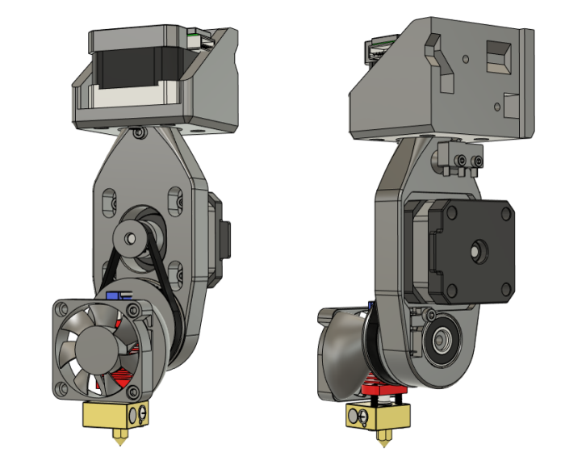
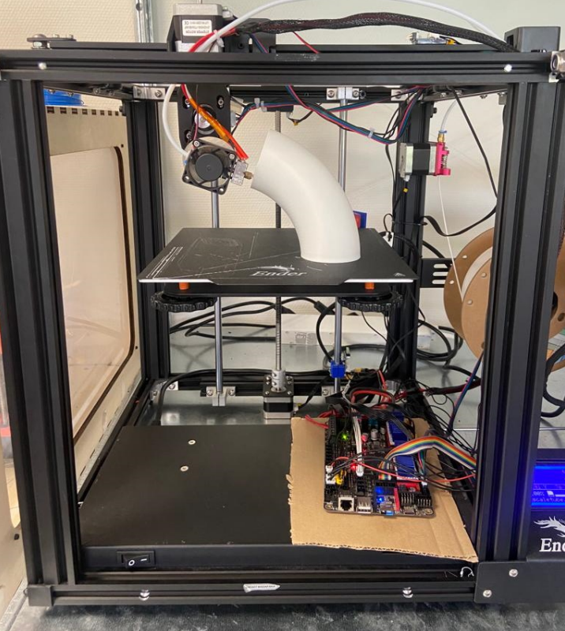

# Rep5x - Ender 5 Pro retrofit

Retrofit kit for Ender 5 Pro printers with RW2.1 5-axis print head.

## Status
- Hardware: Working prototype
- Documentation: Basic
- Testing: Extensively tested
- Firmware: Proven configuration available

## Overview

This is the original prototype configuration that demonstrates the Rep5x concept. The Ender 5 Pro was chosen as the development platform due to its:
- Robust aluminum frame structure
- Large build volume (220x220x300mm)
- Accessible electronics compartment
- Wide availability and documentation

### CAD model

*RW2.1 5-axis print head design showing yaw and tilt rotation capabilities*

### Assembled prototype

*Complete Ender 5 Pro retrofit with Rep5x 5-axis print head installed*

## Files structure

### Mechanical components
- **`3d-printed-parts/`** - All 3D printable components
  - Complete STL files for 5-axis assembly (coming soon)
  - CAD assembly file included
  - Optimized for FDM printing

### Documentation
- **`BOM.md`** - Complete bill of materials with specifications
- **`README.md`** - This overview and assembly guidance
- **`gcode-processing/`** - G-code transformation tools for 5-axis printing

### Assembly resources
- **`3d-printed-parts/FullAssem.f3z`** - Complete Fusion 360 assembly file
- Individual STL files coming soon

## Quick start

### 1. Review requirements
See **[BOM.md](BOM.md)** for complete parts list including:
- Mechanical components (steppers, bearings, fasteners)
- Electronics (slip ring, control board, drivers)
- Printed parts specifications

### 2. Electronics and firmware
This prototype used BTT Octopus V1.1 board with the [Octopus V1.1 Marlin configuration](../../firmware/marlin/configs/octopus-v1.1/). Users can adapt this or use different firmware/boards as needed.

## Status

⚠️ **Working prototype** - Assembly instructions, detailed specifications, and more will be added after more testing and validation.

For questions and updates, join our [Discord community](https://discord.gg/GNdah82VBg).

## Credits

Base design: Janis Andersons  
Continuous rotation modifications: J.L. Meijerman