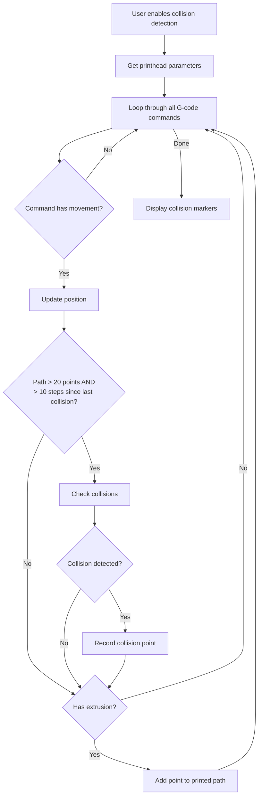
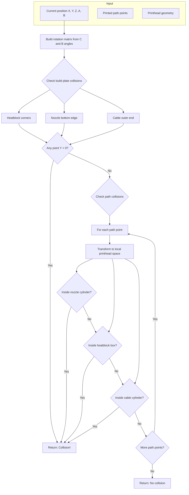
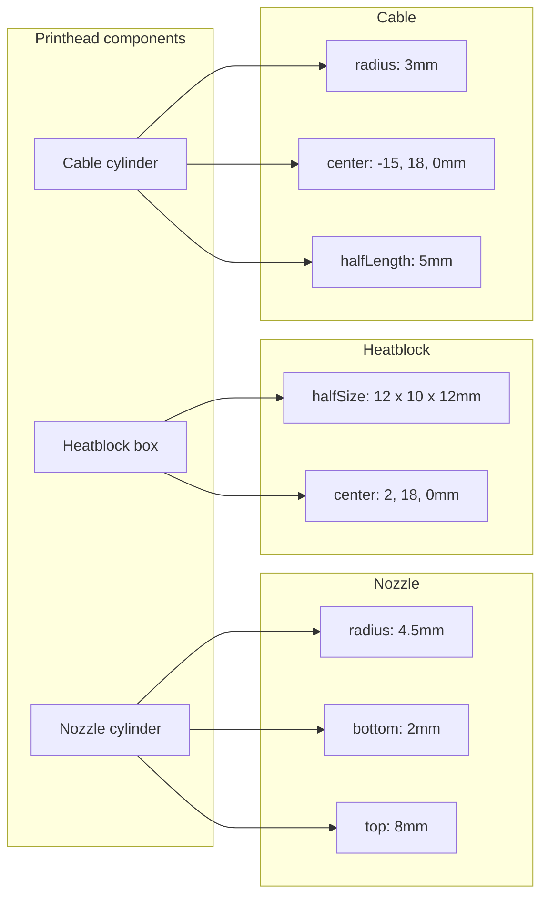
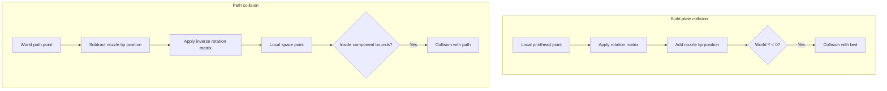

# Collision detection

This document explains how the collision detection system works in the G-code viewer.

## Overview



### Why these checks?

- **Path > 20 points**: Skip collision checks at the start when there's barely anything printed yet
- **> 10 steps since last collision**: Avoid recording hundreds of collision points in the same area
- **Has extrusion**: Only extruded material is added to the path (you can't collide with air)
- **All moves are checked**: Both travel moves (G0) and print moves (G1) check for collisions with the printed path

## Collision check process

For each position, the system checks if any part of the printhead collides with the build plate or previously printed path.



## Printhead geometry

The printhead is defined in local space with the nozzle tip at the origin.



## Coordinate transformation

The collision detection uses matrix transformations to check collisions efficiently.



## Component collision checks

### Nozzle cylinder
```
distance_from_axis = sqrt(x² + z²)
collision = distance_from_axis < radius AND y > bottom AND y < top
```

### Heatblock box
```
relative = point - center
collision = |rel.x| < halfSize.x AND |rel.y| < halfSize.y AND |rel.z| < halfSize.z
```

### Cable cylinder (horizontal along X)
```
relative = point - center
distance_from_axis = sqrt(rel.y² + rel.z²)
collision = distance_from_axis < radius AND |rel.x| < halfLength
```
