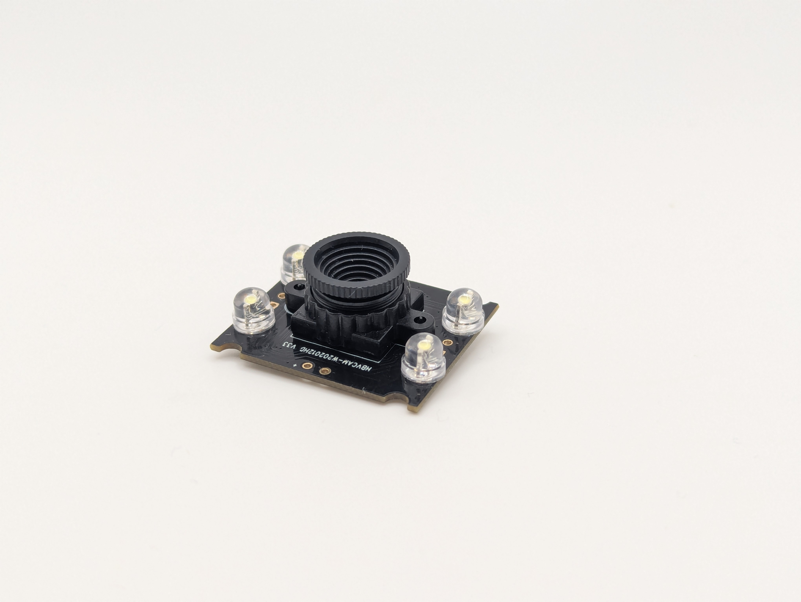
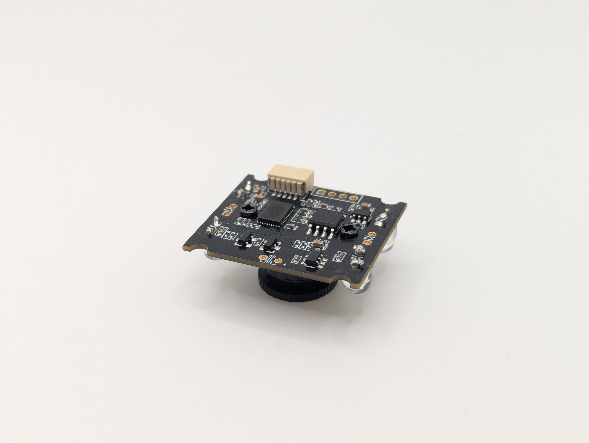
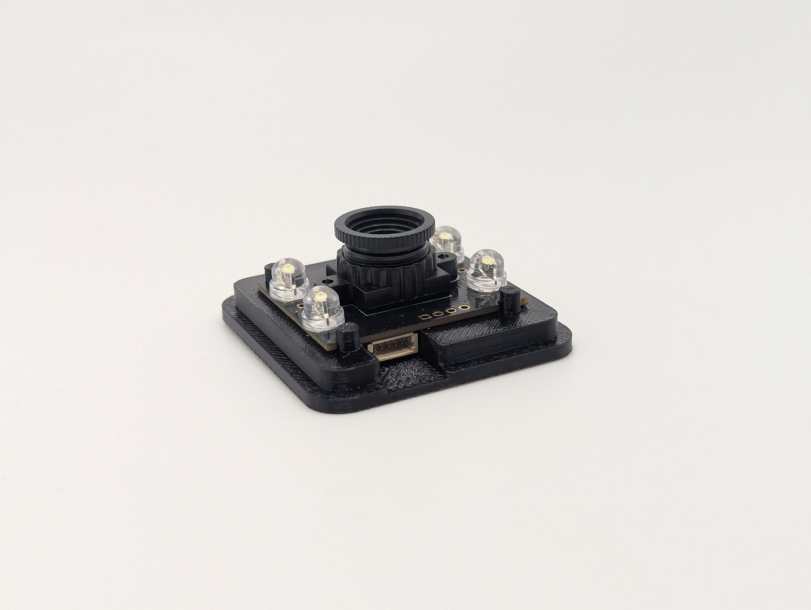
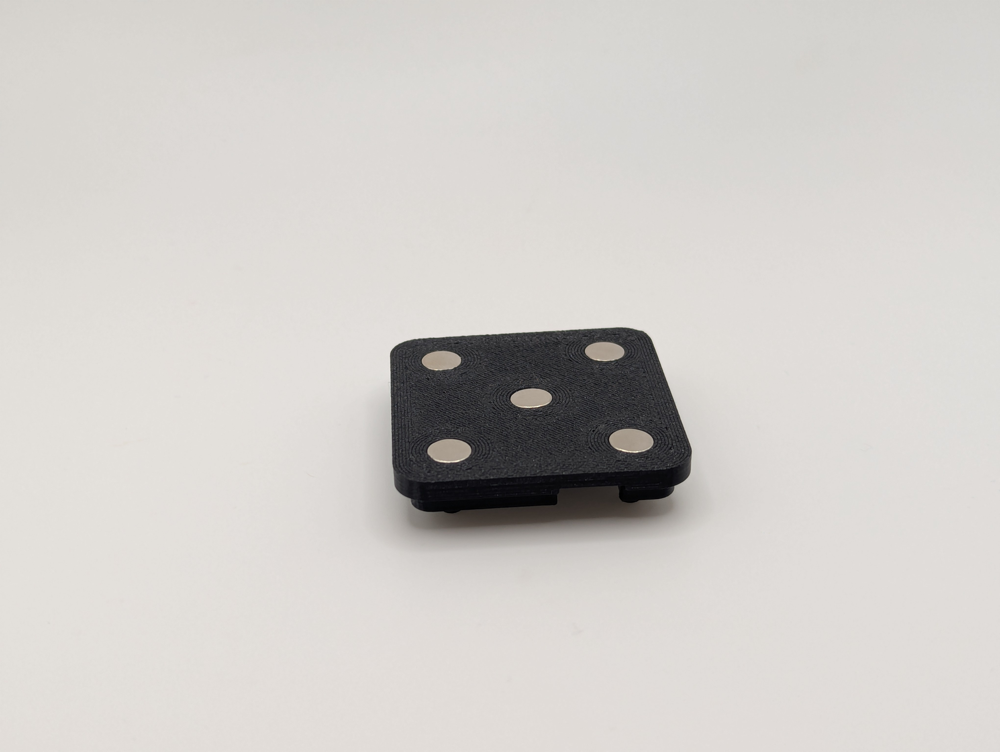
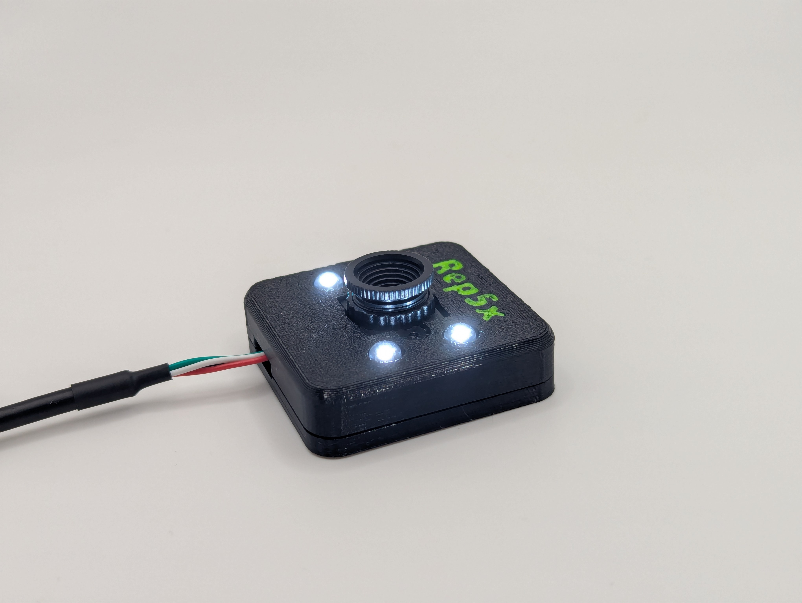
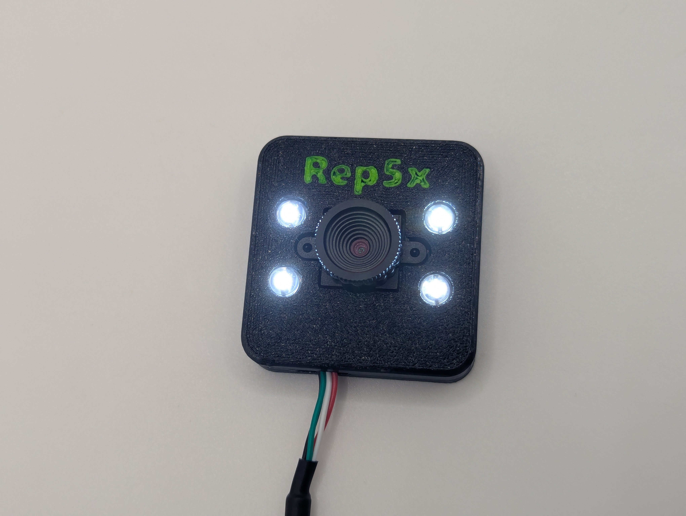
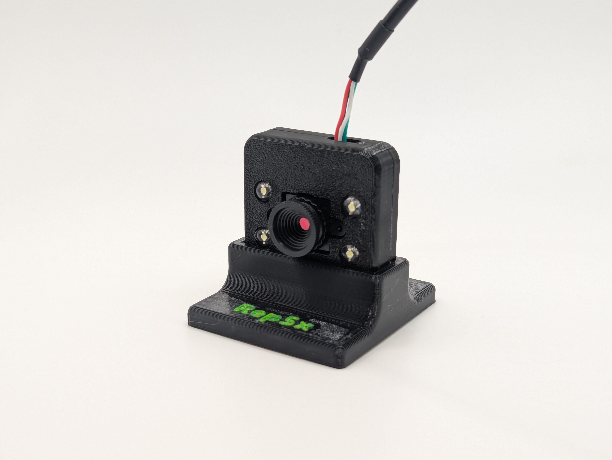

# Rep5x - Camera calibrator

Build guide for the Rep5x camera calibrator module used for visual calibration tasks.

## Overview

The camera calibrator provides accurate visual feedback for LA/LB parameter measurement and other calibration tasks. It features a magnetic mounting system for easy positioning on the printer bed.

## Bill of materials

### COTS components

| Qty | Description | Notes | Purchase links |
|-----|-------------|-------|----------------|
| 1 | OV9726 USB camera module | 1MP, 70° FOV, USB 2.0, plug and play | [AliExpress](https://s.click.aliexpress.com/e/_c4kXJM6n) [Amazon](https://amzn.to/43kfNQX) |
| 4 | 5mm straw hat white LEDs | 120° viewing angle, 3.0-3.2V | [AliExpress](https://s.click.aliexpress.com/e/_c34aCIrt) [Amazon](https://amzn.to/4oBrtqm) |
| 10-16 | 6x2mm neodymium magnets | Gridfinity compatible, friction-fit | [AliExpress](https://s.click.aliexpress.com/e/_c4aZJq5N) [Amazon](https://amzn.to/43yHaXl) |

**Notes:**
- **Camera**: See [OV9726-camera-dimensions.png](images/OV9726-camera-dimensions.png) for exact dimensions and mounting hole locations.
- **LEDs**: Any white LEDs should work. The Fusion 360 files can be modified for different LED sizes.
- **Magnets**: 5 for main mount, 5-9 for Z-axis mount, 2 optional for internal retention.

### 3D printed components

All files available in [`models/`](models/).

| Component | Files | Description |
|-----------|-------|-------------|
| Camera mount bottom | [3MF](models/camera-mount-bottom-v1.3mf) \| [F3D](models/camera-mount-bottom-v1.f3d) | Base with magnet and LED mounting holes |
| Camera mount top | [3MF](models/camera-mount-top-v1.3mf) \| [F3D](models/camera-mount-top-v1.f3d) | Top cover for camera housing |
| Z-axis mount | [3MF](models/camera-mount-z-axis-v1.3mf) \| [F3D](models/camera-mount-z-axis-v1.f3d) | Sideways mount for Z-axis calibration |

**Recommended material:** PLA or PETG

## Total cost

| Component | Cost |
|-----------|------|
| Camera + USB cable | €6.99 |
| LEDs (10 pieces) | €0.96 |
| Magnets (20 pieces) | €1.96 |
| 3D printed housing | ~€0.10 |
| **Total** | **~€10.50** |

---

## Assembly instructions

### 1. Print the housing

Print the camera housing components using standard PLA or PETG filament.

### 2. Solder the LEDs

Solder 4 white LEDs directly to the camera board's VCC and GND pads.

*Top view: LEDs soldered to the camera board*

*Bottom view: Solder connections on the back of the camera board*

### 3. Mount the camera

Insert the OV9726 camera module into the housing. Ensure the lens is properly aligned and can rotate for focus adjustment.

*Camera module installed on the 3D printed mounting base*

### 4. Install the magnets

Press-fit the 6x2mm magnets into the holes on the bottom of the mounting plate. No glue needed - magnets should friction-fit securely.

*Bottom view: Magnets friction-fit into the mounting plate*

### 5. Connect and test

1. Route the USB cable through the housing and connect to your PC
2. The camera should be recognised as a USB video device (no drivers needed)
3. Visit [calibrator.rep5x.com](http://calibrator.rep5x.com/) to test the camera feed
4. Manually twist the lens to adjust focus while viewing the live feed

### Finished assembly

*Side view: Completed Rep5x camera calibrator*

*Top view: All 4 LEDs and camera lens visible*

---

## Z-axis calibration mount

For calibrating the Z-axis, the camera needs to be mounted sideways using the Z-axis mount.

*Camera mounted sideways in the Z-axis calibration mount*

**Features:**
- Holds camera sideways for Z-axis calibration
- 9x magnet mounting holes at bottom (use at least 5 for secure attachment)
- 2x optional internal magnet holes for camera retention
- Good press-fit with camera - internal magnets not required

**Important:** If adding internal magnets, ensure correct polarity - they must **attract** the camera magnets, not repel. Test magnet orientation before pressing into place.

---

## Getting help

- **Community support**: Join our [Discord community](https://discord.gg/GNdah82VBg) for help and discussions